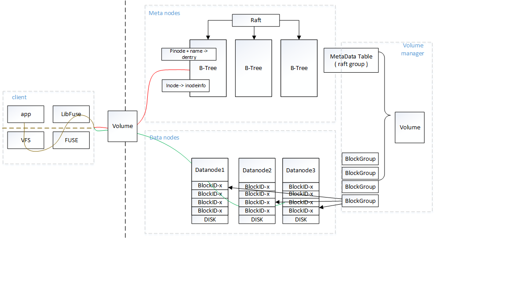

## Containerfs Design

## Architecture

See the later sections for more details of each Containerfs component.

#### Volume  
Volume is a Containerfs instance.  One Containerfs cluster can host millions of volumes.
A volume has one metadata table and unlimited number of block groups

#### Inode  
Inode is a data structure recording the file or directory attributes, indexed with a unique 64bit integer.

#### Metadata Table 
A metadata table has two sorted key-value map , "parent inodeID + name" to dentry attributes , "inodeID" to inode attributes.
One volume is associated with a metadata table.
Metadata tables are replicated via Raft, and not sharded by design. 

#### Block Group  
Fix-sized replicated storage unit of file extents

#### MetaNode
Hosts one or multiple metadata tables

#### DataNode
Hosts one or multiple block groups

#### Volume Manager  
VolMgr holds all the cluster-level metadata, like the volume space quota, nodes status. 

#### Client
FUSE  
Linux kernel

## Communication

## Core Functions

#### Volume create

#### open I/O flow

#### write I/O flow

#### read I/O flow

## Struct
#### volume namespace
<pre>
&nbsp;type VolumeKvStateMachine struct {
&nbsp;	id      uint64
&nbsp;	applied uint64
&nbsp;	raft    *raft.RaftServer
&nbsp;
&nbsp;	dentryItem btree.DentryKV
&nbsp;	inodeItem  btree.InodeKV
&nbsp;	bgItem     btree.BGKV
&nbsp;
&nbsp;	dentryData     *btree.BTree
&nbsp;	inodeData      *btree.BTree
&nbsp;	blockGroupData *btree.BTree
&nbsp;
&nbsp;	chunkIDLocker sync.Mutex
&nbsp;	chunkID       uint64
&nbsp;
&nbsp;	inodeIDLocker sync.Mutex
&nbsp;	inodeID       uint64
&nbsp;}
</pre>

#### dentry
<pre>
&nbsp;message Dirent{
&nbsp;    uint32 InodeType = 1;
&nbsp;    uint64 Inode = 2;
&nbsp;}
</pre>

#### inode
<pre>
&nbsp;message InodeInfo{
&nbsp;    int64 ModifiTime = 1;
&nbsp;    int64 AccessTime = 2;
&nbsp;    uint32 Link = 3;
&nbsp;    int64 FileSize = 4;
&nbsp;    repeated ChunkInfo Chunks = 5;
&nbsp;}
</pre>

#### block group
<pre>
&nbsp;message BlockGroup{
&nbsp;    uint64 BlockGroupID = 1;
&nbsp;    int64 FreeSize = 2;
&nbsp;    int32 Status = 3;
&nbsp;}
</pre>

#### chunk
<pre>
&nbsp;message ChunkInfo{
&nbsp;    uint64 ChunkID = 1;
&nbsp;    int32 ChunkSize = 2;
&nbsp;    uint64 BlockGroupID = 3;
&nbsp;}
</pre>
